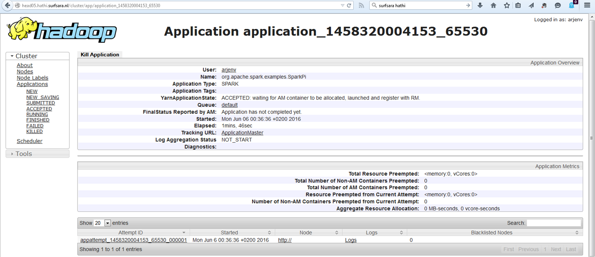

## Commoncrawl

The final project is an open assignment, where we will work with data on the national supercomputer infrastructure managed by SurfSara.

<!--
Follow this link to the *Classroom for Github* [**Commoncrawl** assignment](https://classroom.github.com/assignment-invitations/9cb7fee5465f641427a3a87a5b9140b4), login with your github account, and accept the assignment.
-->

#### Disclaimer (a.k.a. "no worries")

We have yet to see how far we will get - 
the main objective is not so much to prepare a winning submission for the next [Norvig Award](http://norvigaward.github.io/), 
but merely to get hands-on experience in running _and debugging_ jobs on a shared managed cluster, instead of our own laptops or
desktops (that at best emulate a real cluster, and in the worse case will mislead you to underestimating the problems of working 
on actual __Big Data__).

### Preparations

We work on the national [Hadoop cluster](https://userinfo.surfsara.nl/systems/hadoop/description).
Instead of following the _Obtaining an account_ instructions, you receive your account info from me.
After receiving your account info, please [modify your password](https://portal.surfsara.nl/) __as soon as possible__;
do not forget your new credentials, as you'd have to go through the SurfSara helpdesk and I would like to
avoid their involvement as much as possible (I want to give the course next year as well!).

#### Initial setup

Let us work through the basics, additional information can be found at the
[Hadoop cluster usage pages](https://userinfo.surfsara.nl/systems/hadoop/usage).

Start by using the provided docker image.

```
docker pull surfsara/hathi-client

docker run -it surfsara/hathi-client
```

#### Kerberos authentication

Because the national cluster serves many users that not all have access to the same data, authentication is kind-a strict, provided
through MIT's Kerberos.

Inside a Docker container, this works smoothly: 
use your credentials (obtained from me) to get a Kerberos ticket, 
by following the [SurfSara instructions](https://userinfo.surfsara.nl/systems/hadoop/usage).
You do not have to install anything inside the `surfsara/hathi-client` container,
so just start at _1. Setup the environment_ on that page.

__2018 class: I did not yet get the browser settings to work correctly. Hopefully fixed soon.__

<!--
To authenticate through Kerberos _on a Linux or Windows machine_ **outside** the Docker image,
which will be necessary to use the ResourceManager from your web-browser, 
[follow these steps](kerberos.html) (provided without warranty, by me).
-->

_If you use `kinit` with a realm, the capitals of CUA.SURFSARA.NL are an important detail!_

#### Setting up Spark environment

Spark Notebook is not supported on the national hadoop cluster, but Spark is.

Next, let us go through the basics of running a Spark job on the cluster.
Quickly scan the [Surfsara specific instructions](https://userinfo.surfsara.nl/systems/hadoop/software);
to install Spark on the docker image, proceed however with the specific instructions given here.

<!--
```
cd hathi-client
bin/get.sh spark
```
-->

Initialize the right environment for working with Spark by issuing the following command:

```
eval $(/hathi-client/bin/env.sh)
```

(You may want to add this to `${HOME}/.bashrc` so it gets executed next time you run `bash` using `docker exec`.)

#### First steps on Hathi

Now try a simple directory listing of the most recent crawl:

```
hdfs dfs -ls /data/public/common-crawl/crawl-data/CC-MAIN-2016-07
hdfs dfs -ls -h /data/public/common-crawl/crawl-data/CC-MAIN-2016-07/segments/1454702039825.90/warc
```

Then try out the standard example to compute Pi through a random process. 
(The SurfSara cluster requires jobs to be submitted through `yarn`;
just ignore the warning about `yarn-cluster` being deprecated.)

```
cd spark
MASTER=yarn-cluster bin/run-example SparkPi
```

If you managed to get a Kerberos ticket and configured your Firefox correctly, you can view
the application state in the Resource Manager, very similar to this screenshot:


### Using Spark on the cluster

If this succeeded, we are ready for using the cluster for real!

#### Self-contained Spark applications

Before moving on the final project work, carry out the course provided instructions on 
[**executing self-contained Spark applications**](../background/sbt.html).
This helps you run a simple Spark application on the cluster from inside your 
SurfSara Docker container.

### Assignment

Now that you got this far, it is time to be creative and modify the setup and files provided 
for your own project's sake.

The assignment is very open-ended: 
"do something with the Commoncrawl data" and write-up your experience in a final blog post.

Do not forget to check out the Commoncrawl foundation's excellent 
[get started](http://commoncrawl.org/the-data/get-started/) and
[other tutorials](http://commoncrawl.org/the-data/tutorials/).

To identify test data of interest, I recommend to use the public
[CDX Index service](http://index.commoncrawl.org/CC-MAIN-2016-07) to locate a few
WARC files to download for analysis and code development on your local machine:
for example, find the [BBC captures in the crawl](http://index.commoncrawl.org/CC-MAIN-2016-07-index?url=www.bbc.com&output=json),
and check out the corresponding WARC files from the crawl on `hathi`, e.g.,

```
hdfs dfs -ls /data/public/common-crawl/crawl-data/CC-MAIN-2016-07/segments/1454701165302.57/warc/CC-MAIN-20160205193925-00246-ip-10-236-182-209.ec2.internal.warc.gz
```

You can initially work on a small WARC file that you create yourself, e.g.,
using [webrecorder.io](https://webrecorder.io/) or
[a recent `wget` with WARC output](http://www.archiveteam.org/index.php?title=Wget_with_WARC_output) 
(included in the SurfSara docker image):

```
wget -r -l 3 "http://rubigdata.github.io/course/" --warc-file="course"
```

#### WARC for Spark

The [WARC for Spark notebook](BigData-WARC-for-Spark.snb) will be helpful to play with
WARC files in a Spark Notebook, to give a more flexible and efficient approach to 
develop new code _and debug it_, independent of the large cluster.

_You can view the notebook almost correctly using Github's rendering of IPython notebooks, by simply renaming it with an extension `.ipynb`:
[Notebook renamed for rendering by Github](https://github.com/rubigdata/course/blob/gh-pages/assignments/BigData-WARC-for-Spark.snb.ipynb)_

_Note: The collection of [`jar` files](http://rubigdata.github.io/course/background/rubigdata/jars/) for the external dependencies._

#### Other references

SurfSara and the Commoncrawl foundation have provided useful utility code on
the [Norvig Award github repository](https://github.com/norvigaward/warcutils).
(including classes for a `WARCInputFormat`).
Their code is based on the [`jwat` libraries](https://bitbucket.org/nclarkekb/jwat)
(inspecting the code may be useful to understand the `WarcRecord` classes).

The [International Internet Preservation Consortium (IIPC)](http://www.netpreserve.org/) 
provides [utility code](https://github.com/iipc/webarchive-commons)
for `OpenWayback`, an open version of the Internet Archive's Wayback machine.
Other related pointers to help you get going include Jimmy Lin's 
[Warcbase project](https://github.com/lintool/warcbase) and
L3S's recent [ArchiveSpark](https://github.com/helgeho/ArchiveSpark).
Finally, before developing your own code for specific tasks, check the
[SparkPackages community index](https://spark-packages.org/) to see if
your problem has already been solved (partially) before.

#### Blog post 

Imagine a reader that has followed your previous experiences with Spark.
The goal of this post is to share your work on the Commoncrawl data with them,
emphasizing the differences between running locally a prepared notebook versus
a real project on a more unfamiliar remote environment.

Readers will be curious to learn basic statistics about the crawl, but also how
long it takes to make a pass over the data, both on average, and under peak loads.

Ideally, your analysis teaches us something about the Web we did not yet know;
but that is not a requirement for completing the assignment.

_Wishing you good big data vibes!_

#### Final words

When you completed the assignment:

1. Push your blog post to the first assignment's repository (in the `gh-pages` branch or it will not render).
2. Include a link to the published blog post in the README of the A4 assignment repository.
3. Push the updated README as well as your own code or notebook to the A4 assignment repository.

#### Need help?!

Feel free to ask for help, but please do that by using the github issue tracker on [the forum](https://github.com/rubigdata/forum-2018/).
Every student may help out, please contribute and share your knowledge!

_By the way_, before I forget: students from a previous version of this course _did_ win the Norvig Award in 2014! 
If you plan on winning the next edition (I am trying to convince the organizers to run it again), I would love to hear from you!

[Back to assignments overview](../index.html)
